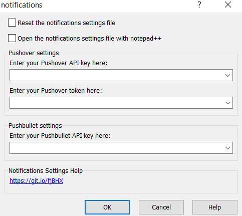
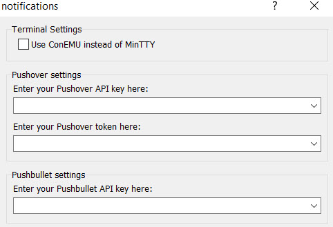
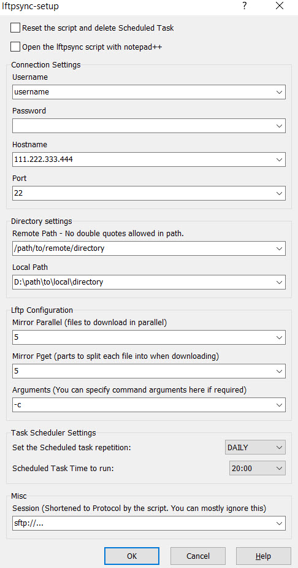
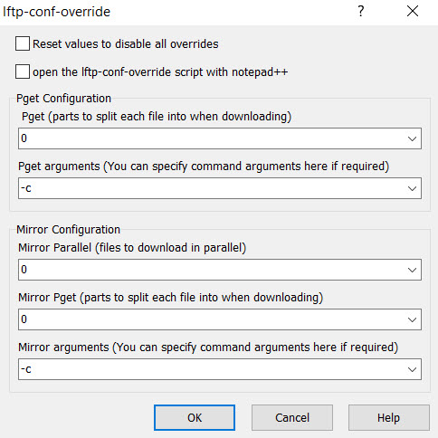
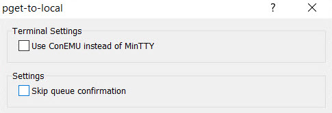
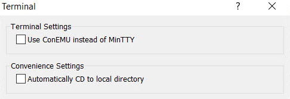
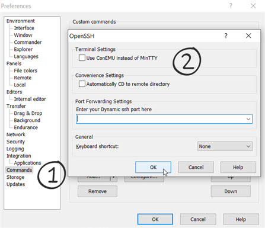

# Lftp for Windows - LFTP4WIN-CORE

Copyright 2020 by userdocs and contributors for LFTP4WIN-CORE

SPDX-License-Identifier: Apache-2.0

Applies to all files included unless those files, created by another author, have their own license. Then that license will apply to those files and any derivatives of this project that makes use of those included works.

Please see the [License](LICENSE.txt) for more details.

## Contents

[Introduction](#introduction)

[Getting Started](#getting-started)

[Commands](#commands)

[Lftp Configuration](#lftp-configuration)

[Lftp mirror automation using task scheduler.](#lftp-mirror-automation-using-task-scheduler)

[Scripts](#scripts)

[Help](#help---how-to-use)

[Updating](#updating)

[Known bugs](#known-bugs)

[Programs included and configured](#programs-included-and-configured)

[Comments](#comments)

## Introduction

[Return to the Contents menu](#contents)

`LFTP4WIN-CORE` is a solution to the problem of using `lftp` in an easy and user friendly way on Windows whilst achieving maximum performance. This is achieved using WinSCP, ConEmu, Cygwin and bash/Windows scripting. This is template deployed by the [LFTP4WIN](https://github.com/userdocs/LFTP4WIN) installer and applied over a configured Cygwin portable installation with a specially configured environment. It can be installed and run as a local user with no elevated privileges required.

To help understand the project as a whole, here is a basic diagram of the work flow and how the components interact.

A special set of bash functions are used to translate WinSCP session variables into bash shell environment variables that can then be used by our Cygwin applications. By combining WinSCP extension features with bash scripting we are able to create a basic GUI experience for using lftp on Windows as well as interface with other applications like OpenSSH.

When all the parts are combined the solution becomes a powerful administrative toolbox for managing remote servers and providing access to Linux tools locally while being 100% portable and self contained.

No admin privileges required, simple to use and with a huge potential to extend functionality even further.

One login to rule them all!

**Disclaimer:** The solution works well to download with `lftp' on Windows x64 but you may experience bottlenecks from peering to your remote host or from your PC hardware and local network setup. For example, an NVME SSD will provide superior results compared to an old mechanical drive. So there is no one configuration that fits all options and you may need to tweak the default lftp settings to find the best way to leverage your current setup to its max potential. The readme should contain all the information you need to understand and configure the solution.

[How to monitor your network performance when using this solution](https://www.ghacks.net/2017/12/28/a-detailed-windows-resource-monitor-guide/)

*Limitations to consider when reviewing results.*

Physical hardware of your device - Lftp can be CPU and disk heavy so factor this into to your expectations of peak performance.

Peering with remote server - Use the `iperf3` command to generate a report.

Local network setup - I don't know your the details of your network setup unless you specifically provide those details for assistance when trouble shooting.

## Getting started

[Return to the Contents menu](#contents)

**Note:** - Installation is documented in the readme for the deployment tool used to install the LFTP4WIN solution - [LFTP4WIN](https://github.com/userdocs/LFTP4WIN)

Inside the main folder of a completed `LFTP4WIN` installation you see these main files once the install is complete.

`Double Click Me - WinSCP Startup.cmd` -Loads your key files in the `/keys` folder and starts WinSCP.

`LFTP4WIN-import.cmd` - Imports your settings from a previous release starting from version `LFTP4WIN` (V2 only)

`LFTP4WIN-terminal.cmd` - Opens a new local terminal session with keyfiles loaded in the session.

`LFTP4WIN-update.cmd` - Updates Cygwin and the LFTP4WIN CORE files - Your configuration files will not be reset.

### Configuring WinSCP

[Return to the Contents menu](#contents)

Run the `Double Click Me - WinSCP Startup.cmd` in the main directory of this solution and it will load WinSCP and any `ppk` format key files in the `keys` directory.

Once WinSCP is loaded you are shown a session manager with a configured template session called `sessionname`.

All you need to do is edit this session to use your server connection details and save it as a new session.

#### Password authentication (easiest solution with the least configuration)

[Return to the Contents menu](#contents)

**Critical note:** Passwords Golden Rules!

**1:** Do not use double quotes `"` or things will break.

**2:** Make sure the password does not end with a `\` or things will break.

**3:** Single quotes can be used and are escaped.

A password like this will work perfectly across the entire solution and all extensions of it, like portable kitty.

 ~~~
 DSref352YjeuakdueW
 ~~~

A password like this will work with the custom commands and lftp but won't work with kitty and WinSCP integration - (I tested this password)

 ~~~
¬`!£$%^&*()_-+={[}]~#:;@'<,>.?/|\}
 ~~~

When you edit the template session in WinSCP by providing a password for authentication you will have a pretty straightforward experience, assuming your followed the golden rules. WinSCP, Kitty and lftp will work with no further configuration required.

**Recommended:** You can also configure a master password to protect your login:

If you don't need to use a private key to authorize your connection you can move on the [commands](#commands) section and skip the next section.

#### Private key authentication

[Return to the Contents menu](#contents)

**Note:** Please read this [guide](https://www.ssh.com/ssh/putty/windows/puttygen) for using puttygen import or create key files.

All you need is to have your key file in the Putty format. You can create a new ppk format key using `puttygen`. It can also load and export an OpenSSH format key to the ppk format.

**Note:** Loading too many keys from the `keys` folder may result in authentication errors. I suggest you keep it simple and only have a few unique keys here relative to your sessions.

**1:** You need to place the Putty format key in your `Keys` directory.

~~~text
Keys/mykeyname.ppk
~~~

**2:** The run the `Double Click Me - WinSCP Startup.cmd` to load all `ppk` keys in the `Keys` directory. If they are password protected you will need to enter this when prompted.

That is all. Your key will automatically be passed to lftp by the script.

#### How key file authentication works

The `Double Click Me - WinSCP Startup.cmd` checks the `keys` folder for `ppk` format keys and automatically loads them into kageant.

`kageant` will provide the key for authentication with WinSCP and Kitty when authorizing to a server.

`ssh-pageant` will use communicate with kageant to provide authentication in ConEmu when it is loaded for lftp and other uses.

## Commands

[Return to the Contents menu](#contents)

**Note:** WinSCP does not have a method to load values from a file when using this custom commands. It will always load the default value unless you have defined a new default in the WinSCP options for the relevant command.

The custom commands are located in the navigation bar at the top of the WinSCP window. In order to properly use this solution you will need to understand and use these custom commands.

**Note:** In WinSCP the local windows are on the left and the remote are on the right. Similar to Filezilla.

Here is brief description of the custom commands you need to understand to use this solution properly.

### notifications

This command will let you set your pushover or pushbullet api settings for notifications.

This command has some options you can set.

### open-lftp-conf

This command opens the main `lftp.conf` file in the  included notepad ++ for editing. Modifications to this file will apply global lftp settings that will take effect in a new local or remote terminal.

**Note:** The `mirror-to-local` and `pget-to-local` commands will have certain settings overridden when configured using the `Lftp Script Options` command but these settings are not globally applied to lftp.

### lftpsync-setup

This custom command will generate the `lftpsync-config.sh` settings for the currently visited local and remote directories and create a scheduled task. If used again it will update all settings. It can be used to reset the `lftpsync-config.sh` script and remove the scheduled task.

This command has some options you can set.

### lftp-conf-override

This custom command edits a file using specified options. Use this to set per command settings that will override the `lftp.conf` defaults when the custom mirror or pget commands are used. They do not apply globally to lftp.

This command has some options you can set.

If the `Lftp Script Options` script settings are blank or set to `0` by default meaning the `lftp.conf` is used until they are manually set.

### mirror-to-local

This command will mirror your selected directory in the lower right remote window of WinSCP to local downloads directory in the in the lower left panel of WinSCP.

This command has some options you can set.

### pget-to-local

This command will pget your selected file in the lower right remote window of WinSCP to local downloads directory in the in the lower left panel of WinSCP.

This command has some options you can set.

### queued-jobs

This command lets you see the queued commands in the jobs file.

### iperf3

Uses this script [https://git.io/fjRIi](https://git.io/fjRIi) to install iperf3 on your remote server and configure it. It will then load via the default terminal and loads the local `iperf3.sh` script to run a test using iperf3 and then generate a report using mtr. The output of the console is logged to `help/report/report-sessioname.txt`

This command has some options you can set.

### lftp

Advanced: This will connect to the remote directory and list all files and folders with lftp. The local directory will be same as the WinSCP local directory at the point of connection. This command is mostly used for debugging and testing but provides functional usage of lftp via the command line.

This command has some options you can set.

### OpenSSH

Open a terminal session and connect to the remote host using OpenSSH - `ssh-pageant` loaded automatically for key file authentication.

This command has some options you can set.

### Terminal

Open a local terminal session with `ssh-pageant` loaded. Your home directory is located in the root of the solution.

This command has some options you can set.

### Custom command configuration

Some commands have options available that change their behaviour. You can access the custom command option in the WinSCP preferences menu.

## SSH access using Kitty

WinSCP has a specific button that has been configured for kitty integration. Just click the button shown in the image below to do this.

**Note:** The integration of OpenSSH via Cygwin using the `OpenSSH` custom command provides a more complete experience.

## Queuing explained

Queuing works when a transfer is already in progress. In WinSCP navigate to the local directory and remote directory or file and use the `mirror-to-local` or `pget-to-local` command again. It will ask you if you want to queue the transfer and automatically initiate it once the previous transfer has completed. It does this by adding a transfer commands to a watched file called `jobs.sh`.

You can queue jobs for different local directories and remote files or directories across different WinSCP sessions by navigating to the required files or locations before using the `mirror` or `pget` commands again.

If you use an post processing extension for `lftpsync.sh` or `mirror-to-local.sh` they will run after each queued command is processed.

## Notifications using Pushbullet or Pushover

### For Pushbullet services

If you don't have an account go make one here [https://www.pushbullet.com/](https://www.pushbullet.com/)

Then you need to visit this URL to generate an API key: [https://www.pushbullet.com/#settings/account](https://www.pushbullet.com/#settings/account)

### For Pushover services

If you don't have an account go make one here: [https://pushover.net/login](https://pushover.net/login)

Then you need to visit this URL to create a new application to generate an API key: [https://pushover.net/apps/build](https://pushover.net/apps/build)

You can find your user key here: [https://pushover.net/](https://pushover.net/)

Once you have created an account with either or both services you need to use the `notifications` custom command in a WinSCP session to enter and save your API details.

Once you have done that you will get a Pushbullet or Pushover notification to your devices when either a mirror, pget or sync task completes.

## Lftp configuration

[Return to the Contents menu](#contents)

By default lftp settings are managed in the `lftp.conf` which can be accessed by these recommended methods:

**1:** Using the WinSCP custom command `open-lftp-conf`

**2:** Using the `start - notepad ++.cmd` file in the `help` directory.

You should manage your settings here unless you want to have different settings for mirror and pget commands. In order to different settings for each command you can set the variables using the WinSCP custom command `lftp-conf-override`.

## Lftp mirror automation using task scheduler

[Return to the Contents menu](#contents)

**Critical note:** Passwords Golden Rules!

**1:** Do not use double quotes `"` or things will break.

**2:** Make sure the password does not end with a `\` or things will break.

**3:** Single quotes can be used and are escaped.

*Note: Values 1-10 are automatically populated by the WinSCP custom command `lftpsync-setup` once you have successfully connected to a server with WinSCP. Enter, not select, the local and remote directories you want to sync then use the command.*

**Step 1:** Connect to your server using WinSCP and use the custom command `lftpsync-setup`. It can automatically fill these settings. Running this command again will regenerate all script settings and the scheduled task settings based on the settings of the current command. The reset box resets the script and deletes the scheduled task.

`1` - The connection username.

`2` - The connection password - if not using a key file, otherwise you can leave it blank.

`3` - The server hostname.

`4` - Your connection port.

`5` - Your protocol type `sftp` or `ftp` using ssl/tls.

`6` - The remote directory you want to mirror.

`7` - Your local directory for downloaded files. If empty the default`/Download` location is used.

`8` - Optional `mirror_parallel_transfer_count` settings you want the script to use. `lftp.conf` is used if this is blank or `0`.

`9` - Optional `mirror_use_pget_n`settings you want the script to use. `lftp.conf` is used if this is blank.

`10` - Optional `mirror_args` settings you want the script to use. `-c` is the default switch used.

**Step 2:** Optional - You can use the `1 - Optional - lftpsync settings tester.cmd` to run the script in ConEmu to test your connection settings. ConEmu will not run minimized or close upon completion.

**Step 3:** Optional - You can use `2 - Optional - lftpsync settings debugging.cmd` to perform the same test as option 1 but with debug enabled and set to level 10.

**Step 4:** Optional - You can use the `3 - Optional - test lftpsync task.cmd` to run the task now and check it works as intended.

**Step 5:** Optional - You can use `4 - Optional - start taskscheduler.cmd` to tweak the ltfpsync task settings in the task scheduler.

**Step 6:** Optional - You can use the `5 - Optional - delete lftpsync task.cmd` delete lftpsync task from the task scheduler.

**Step 7:** Optional - You can use the `6 - Optional - edit lftp options.cmd` to edit the `lftp.conf` if you need to use some specific settings. If you set the connections settings in the custom command they will override the matching `lftp.conf` settings unless they were set to `0` or left blank.

Congratulations, you are now using lftp on Windows automated via Windows Task Scheduler.

Set it and forget it.

## Scripts

[Return to the Contents menu](#contents)

Here is a brief description of script included.

**Note:** The `lftpsync.sh`, `lftp-winscp-mirror` and `lftp-winscp-pget` use the same hard coded lock file `lftp-winscp.lock` so as not to run another download in parallel while any other download are in progress. They will all check to see if lftp is actually running and clear dead lock files.

`functions.sh` - The heart of the solution. It contains functions used across most scripts to process information passed by WinSCP.

`lftpsync.sh` - A mirror script for use with ConEmu or as a scheduled task. The original idea of this project.

`lftpsync-config.sh` - The settings file for the `lftpsync.sh` script.

`lftp-winscp-mirror.sh` - A heavily modified clone of the `lftpsync.sh` to be used and modified specifically with WinSCP for mirroring remote directories to a local directory.

`lftp-winscp-pget.sh` - A heavily modified clone of the `lftpsync.sh` changed to use `pget` instead of mirror to be used and modified specifically with WinSCP for downloading a single file to a local directory.

`lftp-conf-override.sh` - A script accessed by the custom command `lftp-conf-override` to change or reset the main variables used for the `lftp-winscp-mirror.sh`, `lftp-winscp-pget.sh`.

`install.iperf.sh` - A local copy of the remote installation script used by the `iperf3` command. This script is not used locally and can be ignored.

`lftpsync.cmd` - This is file the the Windows Task Scheduler uses to process the `lftpsync.sh` task.

## Help - how to use

[Return to the Contents menu](#contents)

There is a help folder with some tools to edit scripts,files and fix permissions.

`remove usb.cmd` - Run this to close the main apps included. This is what the file contains.

~~~
taskkill /f /im "ssh-pageant.exe"
taskkill /f /im "kageant.exe"
taskkill /f /im "WinSCP.exe"
taskkill /f /im "bash.exe"
taskkill /f /im "ConEmu64.exe"
taskkill /f /im "notepad++.exe"
taskkill /f /im "kitty_portable.exe"
taskkill /f /im "ssh.exe"
taskkill /f /im "lftp.exe"
taskkill /f /im "curl.exe"
~~~

`start notepad++.cmd` - Will load the included notepad ++ and some important files.

*Use these troubleshooting files with caution! They are not to be used casually.*

From version `2.0` these files should no longer be needed but I'll leave them here just in case.

`troubleshooting - ownership - recycle bin.cmd` - Use only if you deleted transferred files that corrupted the recycle bin.

`troubleshooting - ownership.cmd` - Use only if you are have file ownership issues with transferred files.

## Updating

[Return to the Contents menu](#contents)

With the release of version `2.0` there is a file called `LFTP4WIN-import.cmd` in the top level of the solution. When you run this file it will ask you to select another LFTP4WIN (2.0 or newer) directory that you want to import your settings from.

It will import these files and settings:

- Home folder - This is your bash home directory when you use `~` or `$HOME`
- Keyfiles.
- Downloads
- notifications
- `lftp-conf-override.sh` script file
- `lftpsync-config.sh` script file
- WinSCP settings
- Kitty settings

Windows task scheduler jobs are not changed. As long as the new LFTP4WIN folder replaces the old one after the import is complete your scheduled task will continue to work.

The WinSCP custom commands are loaded as WinSCP extension files and are independent from the main `WinSCP.ini` file. Extensions are loaded from the `system/applications/winscp` directory and have the name format of `winscp-command-name.WinSCPextension` and they are automatically loaded into WinSCP when it starts. You can add your own in the same way.

*Note: Extensions can have the extension of the language they use. So `winscp-command-name.WinSCPextension` cna be `winscp-command-name.WinSCPextension.sh` if it is a bash script.*

**ConEmu:** This program automatically checks for updates when running. It will prompt you.

**WinSCP:** You update this by downloading the portable binaries from the WinSCP website and placing the `WinSCP.exe` and `WinSCP.com` file in the `system/applications/winscp` directory.

**Kitty and Pageant:** You update these by downloading new release and replacing the files in the `system/applications/kitty` directory.

**Cygwin** Use the `LFTP4WIN-update.cmd` file to update Cygwin.

## troubleshooting

[Return to the Contents menu](#contents)

### WinSCP

You have updated WinSCP and lost the custom commands?

Occasionally a new version of WinSCP resets the layout. Then all you need to do is right click somewhere on the top section of WinSCP to access the toolbar context menu and enable custom commands. They will show again.

### Kitty

Here is the integration command used in case it gets lost or changed.

~~~
"%WINSCP_PATH%\..\kitty\kitty_portable.exe" -pw "!P" "!U@!@" -P "!#" -title "!N" -classname "lftp4win" -cmd "cd '!/'"
~~~

### lftp

You can enable debugging in the `lftp.conf` by removing the comment `#` before the `# debug 10 -o "~/lftp-debug.log"` at the top of the file. This log is saved to the home folder in the main folder.

You access the `lftp.conf` by using one of these methods:

Using the WinSCP custom command `open-lftp-conf` for loading this file into notepad++

By using the `6 - Optional - edit lftp options.cmd` in the automation folder.

By using the `start - notepad ++.cmd` in the help folder.

### lftp automation

You are having trouble connecting with the `lftpsync.sh` script?

Use the debugging option and it should provide useful information to help.

## Known bugs

[Return to the Contents menu](#contents)

Sometimes, when `mirror-to-local` to a custom directory lftp gets confused and creates an empty `cygdrive` folder shortly after the download starts. This removed by the scripts just before exiting.

*Never us `rm` on this `/cygdrive` as it will get interpreted as `/cygdrive/c` and try to wipe you C drive.*

## Programs included and configured

[Return to the Contents menu](#contents)

All programs included are unmodified from their original releases. They are only customized using available configuration files or settings. They retain whatever licensing they were released with.

`WinSCP Portable` - the main application that you will use.

`ConEmu` - the windows terminal that runs the Cygwin binaries and interprets the bash scripts.

`Cygwin` - A fully functional Cygwin installation.

`Notepad ++ portable` - Used with `cmd` files to automatically load provided scripts for editing.

`Kitty portable` - loaded within the WinSCP GUI for `ssh` access to your configured servers.

`Kageant` - required for key file + server authentication.

`unrar` - [https://www.rarlab.com/rar_add.htm](https://www.rarlab.com/rar_add.htm)

`unrarall` - [https://github.com/arfoll/unrarall](https://github.com/arfoll/unrarall)

`p7zip` - standalone console version - [https://www.7-zip.org/download.html](https://www.7-zip.org/download.html)

`mtr` - [https://github.com/traviscross/mtr](https://github.com/traviscross/mtr)

`iperf3` - [https://iperf.fr/iperf-download.php](https://iperf.fr/iperf-download.php)

## Comments

[Return to the Contents menu](#contents)

What remains is to document how to extend and build on top of it to create further custom commands and integration.

[https://winscp.net/eng/docs/start](https://winscp.net/eng/docs/start)

[https://winscp.net/eng/docs/custom_command](https://winscp.net/eng/docs/custom_command)

[https://winscp.net/eng/docs/extension](https://winscp.net/eng/docs/extension)
